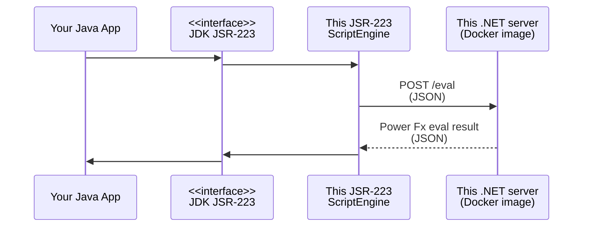

This is an Open Source community project.

# JSR-223 Power Fx

A JSR-223 implementation for evaluating Power Fx formulas (expression) by making use of a server implemented on F# and .NET platform.


# How to use

Run docker image with:

```bash
docker run -p 80:5000 jsr223-powerfx-server
```

Include this dependency in your Java project.

Example usage:

```java
ScriptEngineManager MANAGER = new ScriptEngineManager();
ScriptEngine engine = MANAGER.getEngineByName("powerfx");
Bindings bindings = engine.createBindings();
bindings.put("a", 1);
bindings.put("b", 2);
Object result = engine.eval("a+b", bindings); // result = 3
```

# References

Helpful references I've used while building this experiment
- Wu, C. (2010). Dynamic Languages on JVM. In: Pro DLR in .NET 4. Apress, Berkeley, CA. https://doi.org/10.1007/978-1-4302-3067-0_12
- https://github.com/microsoft/power-fx-host-samples/issues/10
- Web Development with F# on .NET Core https://www.youtube.com/watch?v=W8qAUJIVj8c
- https://www.codesuji.com/2020/03/08/F-and-Docker/
- https://docs.microsoft.com/en-us/dotnet/core/docker/build-container?tabs=linux
- https://stackoverflow.com/a/60132230/893991
